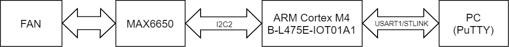
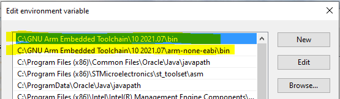
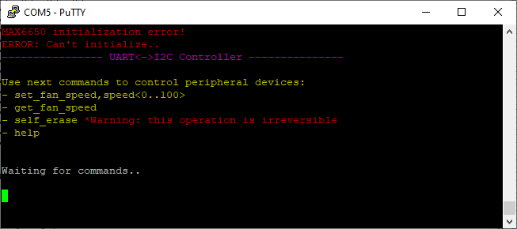
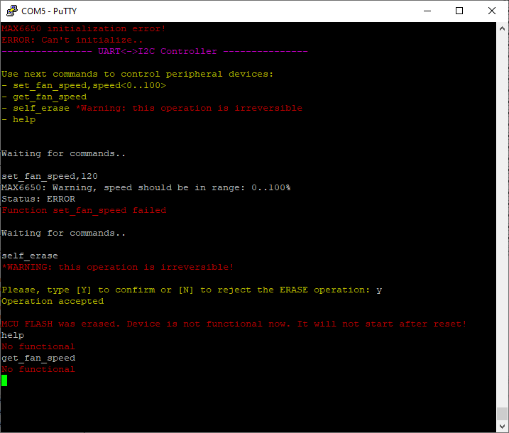

**This is solution for https://github.com/netronixgroup/embedded-task**

## Connection overview



The system consists of FAN(12V, 10500 rpm) + [MAX6650 FAN controller](https://datasheets.maximintegrated.com/en/ds/MAX6650-MAX6651.pdf) + Cortex M4 MCU ([B-L475E-IOT01A1 devkit](https://www.st.com/en/evaluation-tools/b-l475e-iot01a.html#overview)) that is connected to PC through onboard ST-Link with Virtual COM Port.

MAX6650 code placed in an external library and linked to the firmware code. 

## How to build

[GNU Arm Embedded Toolchain](https://developer.arm.com/tools-and-software/open-source-software/developer-tools/gnu-toolchain/gnu-rm/downloads) should be installed for code building .
Make sure that your system variables contain the necessary. If you use Windows, it should look like that ( `System Properties -> Environment variables -> Edit "Path" variable` ):



### 1. Build MAX6650 library

```console
cd project_folder\libs\max6650\src
make
```

As a result, `libmax6650.a` should be generated in the `<project_folder>\libs\max6650\src\out` folder

### 2. Build Main Application

```console
cd ..\..\..\src
make -j8
```

As a result, `max6650_test.bin, .hex, elf` -files should be generated in the `<project_folder>\src\out` folder

## Program the microcontroller Flash-memory

You can use  [ST Visual Programmer](https://www.st.com/en/development-tools/stvp-stm32.html) software interface for programming microcontroller's Flash.


## Run

Use [PuTTY](https://www.putty.org/) to connect with microcontroller

**COM Port settings:**

* Speed 155200

After `reset` you should see text menu in the terminal. Just type commands from list to see results:



`*MAX6650 Initialization error shows because of MAX6650 IC is not connected to the I2C-bus.`

## Supported commands

* “set_fan_speed,&lt;speed 0..100%>”
    * responds with actual speed or error status
* “get_fan_speed”
    * responds with actual speed or error status    
* “self_erase”
    * responds with a worry message about irreversibility of the action and asks for confirmation. After confirming with the user the firmware erases the internal flash. After this firmware responds to all commands with “no functional”.
* “help”
    * printing menu again

## Example



After calling "self_erase" command STM32 Flash was erased, UART related functions handles from RAM to print "No functional" for any incoming command.